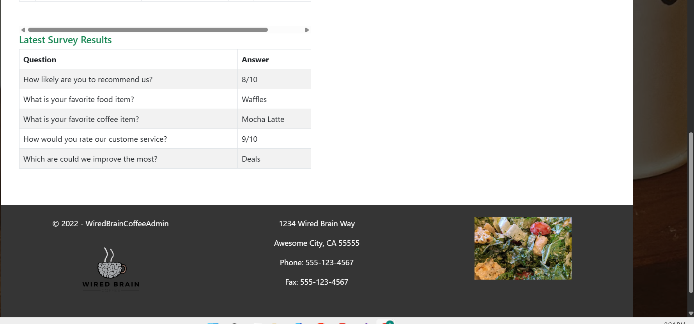
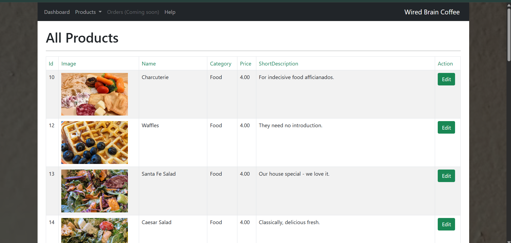
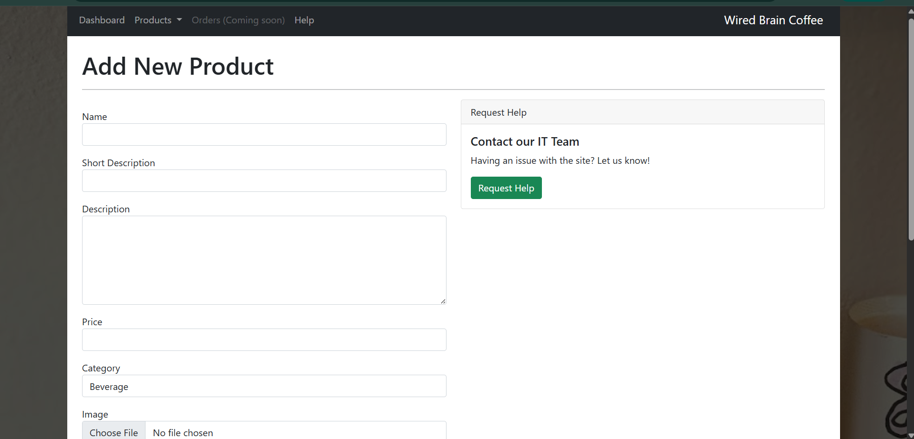
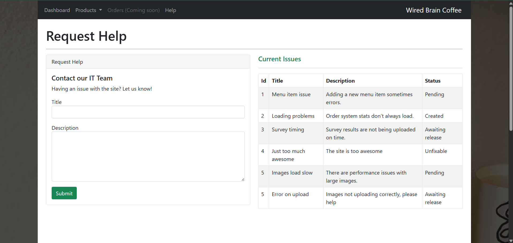

# WiredBrain Coffee – Admin Dashboard

An ASP.NET Core Razor Pages admin dashboard for managing products, surveys, and business statistics in a coffee shop environment.

This project was built as a practical implementation of Razor Pages and Entity Framework Core, focusing on clean architecture, CRUD operations, and admin interface design.

---

## 🚀 Features

- Product Management (Create, Edit, Delete, View)
- Category-based product organization
- Dashboard with latest products
- Weekly statistics overview
- Survey results display
- Admin layout with navigation
- Responsive UI using Bootstrap
- Entity Framework Core integration
- Database migration support

---

## 🛠️ Technologies Used

- ASP.NET Core
- Razor Pages
- C#
- Entity Framework Core
- SQL Server / LocalDB
- Bootstrap
- LINQ

---

<h2>📸 Screenshots</h2>

<h3>Dashboard</h3>

<h3>Products</h3>

<h3>Add New Item</h3>

<h3>Help</h3>

---

## 🧱 Project Structure
WiredBrainCoffeeAdmin/
│
├── Pages/ # Razor Pages
├── Data/ # DbContext & Seed Data
├── Migrations/ # EF Core Migrations
├── wwwroot/ # Static files (CSS, JS, Images)
├── appsettings.json # Configuration & Connection Strings
└── Program.cs # Application startup configuration

---

## ⚙️ Getting Started

### 1️⃣ Clone the Repository

git clone https://github.com/your-username/wiredbrain-coffee-admin.git

### 2️⃣ Configure Database

Update the connection string inside `appsettings.json`:

"ConnectionStrings": {
  "WiredBrain": "Server=(localdb)\\MSSQLLocalDB;Database=WiredBrain;Trusted_Connection=True;"
}

3️⃣ Apply Migrations
Using Package Manager Console:

Update-Database
Or using .NET CLI:

dotnet ef database update
4️⃣ Run the Application
dotnet run

---

📊 Purpose of This Project

This project was developed as a hands-on practice application to strengthen understanding of:
Razor Pages architecture
Entity Framework Core
Database migrations
Admin dashboard UI patterns
CRUD operations
Clean project structure

---

🎯 Future Improvements

Authentication & Authorization
Role-based access control
Order management module
REST API integration
Chart-based analytics visualization
Docker containerization

📄 License

This project is for educational and portfolio purposes.
